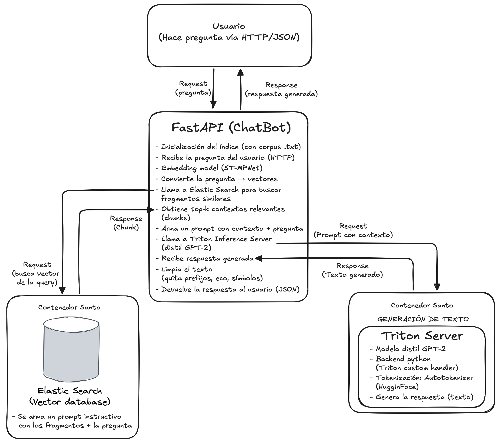

# 🤖 ChatBot-RAG: Recuperación + Generación
Sistema inteligente de preguntas y respuestas que combina FastAPI, Elasticsearch y Triton Server para generar respuestas basadas en contexto.

⸻

## ⚙️ Tecnologías utilizadas

| Componente               | Descripción técnica                                                  |
|--------------------------|----------------------------------------------------------------------|
| **FastAPI**              | Framework web para construir APIs rápidas y modernas                |
| **SentenceTransformer**  | Modelo `paraphrase-multilingual-mpnet-base-v2` para embeddings       |
| **Elasticsearch**        | Base de datos vectorial para búsqueda semántica                      |
| **Triton Server**        | Motor de inferencia NVIDIA (modelo distil GPT‑2 en GPU)              |
| **Tokenizador**          | HuggingFace `AutoTokenizer` compatible con GPT‑2                     |

⸻

## 🔁 Flujo de procesamiento

1️⃣ **Usuario** hace una pregunta vía HTTP/JSON  
2️⃣ **FastAPI** convierte la pregunta en vector con ST-MPNet  
3️⃣ Se buscan los fragmentos más similares en **Elasticsearch**  
4️⃣ Se arma un prompt instructivo con contexto + pregunta  
5️⃣ **Triton** genera la respuesta basada en ese contexto  
6️⃣ Se limpia la respuesta (prefijos, símbolos, eco)  
7️⃣ La respuesta se envía de vuelta al usuario

⸻

## 🧪 Ejemplos de uso con `curl`

### ✅ Sin alucinación

```bash
curl -X POST http://localhost:8005/chat \
  -H "Content-Type: application/json" \
  -d '{"query": "¿Cuántas horas duerme un gato al día?"}'
```

Esperado: devuelve respuesta con evidencia del corpus (cat-facts.txt).

---

### ❌ Con alucinación

```bash
curl -X POST http://localhost:8005/chat \
  -H "Content-Type: application/json" \
  -d '{"query": "¿Los gatos pueden programar en Python?"}'
```

Esperado: responde: “Lo siento, no dispongo de información…”

⸻

📊 Métricas recomendadas

Puedes agregar gráficas que comparen:
- Similitud promedio por pregunta
- Porcentaje de respuestas alucinadas vs. válidas
- Tiempo promedio por componente (embedding, búsqueda, inferencia)

⸻

📦 Requisitos (requirements.txt)

fastapi==0.110.1  
uvicorn==0.29.0  
pydantic==2.6.4  
transformers==4.40.0  
sentence-transformers==2.6.1  
tritonclient[http]==2.43.0  
numpy==1.24.4  
requests==2.31.0  
tokenizers==0.15.2  
typing-extensions==4.5.0  

⸻

📈 Diagrama general del ChatBot con RAG


